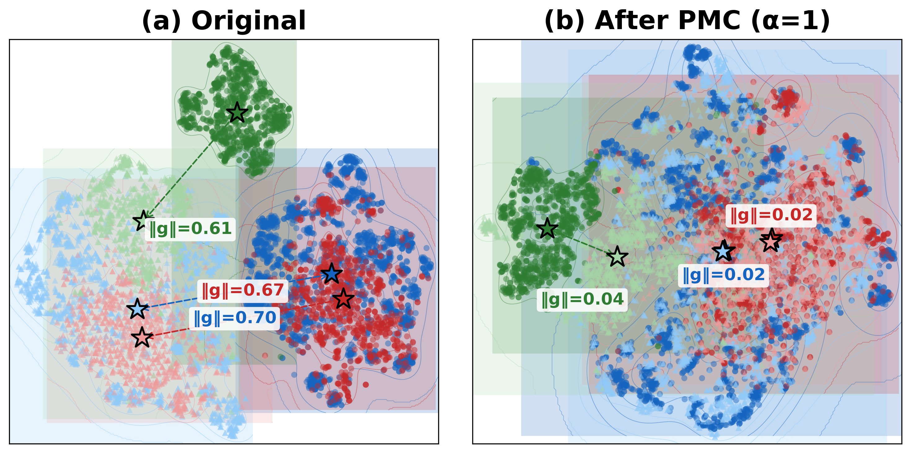
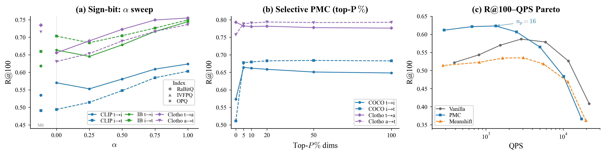

# PMC

### PMC: Build-Time Per-Modality Centroid Correction for Cross-Modal Binary-Quantized Retrieval

[](https://dl.acm.org/conference/cikm)
[](https://www.python.org/)
[](LICENSE)

---

PMC is a **zero-cost preprocessing step** that fixes the modality gap problem in binary quantized retrieval (RaBitQ). A one-line vector shift applied at index build time closes the gap between text and image centroids, recovering up to **+48% R@100** with no change in memory or throughput.

<p align="center">
  
</p>

<p align="center"><em>
  <b>Figure 1.</b> t-SNE visualization of cross-modal embeddings. <b>(a)</b> Original CLIP/ImageBind features show a clear modality gap (‖g‖ = 0.61–0.70). <b>(b)</b> After PMC (α=1), all modalities collapse to a shared centroid (‖g‖ ≈ 0.02), directly improving sign-bit alignment.
</em></p>

---

## Key Results

### Sign-bit retrieval — IVF-RaBitQFastScan

R@100, reported as **Vanilla / MeanShift / PMC**. `q→db` = text→image/audio; `db→q` = reverse. Δ = relative R@100 gain (Vanilla→PMC).

| Dataset | Enc. | ‖g‖ | Dir. | Vanilla | MeanShift | PMC | Δ |
|---------|------|-----|------|---------|-----------|------|---|
| MSCOCO val5k | CLIP-ViT-B/32 | 0.82 | q→db | 0.57 | 0.53 | **0.63** | +10% |
| MSCOCO val5k | CLIP-ViT-B/32 | 0.82 | db→q | 0.49 | 0.49 | **0.60** | +22% |
| MSCOCO val5k | CLIP-ViT-L/14 | 0.82 | q→db | 0.54 | 0.53 | **0.65** | +20% |
| MSCOCO val5k | CLIP-ViT-L/14 | 0.82 | db→q | 0.46 | 0.50 | **0.63** | +37% |
| MSCOCO val5k | ImageBind | 0.70 | q→db | 0.67 | 0.62 | **0.75** | +12% |
| MSCOCO val5k | ImageBind | 0.70 | db→q | 0.70 | 0.66 | **0.75** | +7% |
| Flickr30K | CLIP-ViT-L/14 | 0.77 | q→db | 0.39 | 0.34 | **0.48** | +23% |
| Flickr30K | CLIP-ViT-L/14 | 0.77 | db→q | 0.31 | 0.35 | **0.46** | +48% |
| Clotho | ImageBind | 0.61 | q→db | 0.72 | 0.60 | **0.73** | +2% |
| Clotho | ImageBind | 0.61 | db→q | 0.62 | 0.51 | **0.68** | +11% |
| AudioCaps | ImageBind | 0.61 | q→db | 0.75 | 0.78 | **0.79** | +5% |
| AudioCaps | ImageBind | 0.61 | db→q | 0.82 | 0.82 | **0.83** | +1% |

### LAION-400M (407M vectors, CLIP-ViT-B/32)

R@100 at `n_list=20K, n_probe=256`, single-thread CPU (i7-12700F):

| Dir. | Vanilla | MeanShift | PMC | Δ |
|------|---------|-----------|------|---|
| q→db (text→image) | 0.095 | 0.072 | **0.137** | +44% |
| db→q (image→text) | 0.058 | 0.042 | **0.072** | +24% |

> PMC adds **zero memory** and keeps query throughput within **1%** of vanilla RaBitQ across all configurations.

---

## Method

Cross-modal embeddings (e.g., CLIP text vs. image) cluster around **different centroids** per modality. RaBitQ's sign-based encoding assumes a shared distributional center; the centroid mismatch flips roughly 16% of signs near the decision boundary, causing systematic recall loss.

PMC corrects both sides with a single offset:

```
g  = mean(query_features) − mean(db_features)          # modality gap vector

x' = normalize(x + α · g)       # database vectors at build time
q' = normalize(q − (1−α) · g)   # query vectors at search time
```

With `α = 1`, the full correction is absorbed into the index at build time (zero query-time overhead). The gap vector `g` is computed once from a small calibration set (~5K samples) and stored alongside the index.

## Analysis

<p align="center">
  
</p>

<p align="center"><em>
  <b>Figure 3.</b> <b>(a)</b> Sign-bit α sweep — R@100 improves monotonically with α across all backbones and index types (RaBitQ, IVFPQ, OPQ); α=1 is optimal. <b>(b)</b> Selective PMC — correcting only the top-5% gap-energy dimensions already recovers peak recall on MSCOCO; low-gap Clotho needs broader correction. <b>(c)</b> R@100–QPS Pareto — PMC dominates vanilla and mean shift at every operating point.
</em></p>

---

## Installation

```bash
pip install -r requirements.txt
python -m pytest tests/ -x -q
```

**Requirements:** Python 3.9+, NumPy, faiss-cpu (or faiss-gpu), PyTorch (for encoder scripts only).

---

## Reproduction

Each script maps to one paper element. Run from the repo root.

| Script | Paper Element |
|--------|---------------|
| `scripts/reproduce_table1_signbit.py` | Table 1: Sign-bit methods (R@100, Vanilla/PMC) |
| `scripts/reproduce_table2_main_aggregator.py` | Table 2: Main PMC results (IVF-RaBitQFastScan) |
| `scripts/reproduce_laion400m.py` | Table 2: LAION-400M large-scale row |
| `scripts/reproduce_table3_pq_sweep.py` | PMC + PQ alpha sweep (feeds Table 5; Fig. 3a) |
| `scripts/reproduce_table5_multibit.py` | Table 5: Multi-bit IVFPQ/OPQ generality |
| `scripts/reproduce_mechanism_controls.py` | Tables 3-4: bit-flip/J@100, exact control, component ablation, calibration sensitivity |
| `scripts/reproduce_mechanism_additional_controls.py` | Table 4: Additional IVF-RaBitQ controls |
| `scripts/reproduce_figure_c.py` | Figure: Selective PMC analysis |
| `scripts/reproduce_qps_pareto.py` | QPS vs Recall Pareto plot |
| `scripts/reproduce_clotho.py` | Clotho audio retrieval (R@1) |
| `scripts/reproduce_audiocaps.py` | AudioCaps audio retrieval (R@1) |
| `scripts/generate_figure.py` | Combined 2×2 figure for paper |

### Quick mechanism check (no GPU required)

```bash
PMC_FEATURES_DIR=data/features \
python scripts/reproduce_mechanism_controls.py \
  --settings mscoco_clip audiocaps_imagebind --skip-heavy
```

Expected outputs in `results/`:
- `mechanism_bitflip.csv` (24 rows)
- `mechanism_exact_control.csv` (8 rows)
- `mechanism_component_ablation.csv` (8 rows)
- `mechanism_calibration_sensitivity.csv` (50 rows)

---

## Data Requirements

Scripts expect pre-extracted features under `data/features/`. This directory is not included in the repo (features can be several GB).

**Directory layout:**
```
data/features/
  mscoco/
    clip-b32/   ← image_db.npy, text_queries.npy
    clip-l14/
  flickr30k/
    clip-l14/
  audiocaps/
    imagebind/
  laion400m/
    clip-b32/
```

To reproduce from scratch:

1. Extract CLIP-ViT-B/32, CLIP-ViT-L/14, or ImageBind embeddings for the target dataset.
2. Place `.npy` files under the corresponding subdirectory.
3. Override paths in `config/paths.yaml` if your layout differs.

Supported datasets: MSCOCO val5k, Flickr30K, AudioCaps test, Clotho test, LAION-400M.

---

## Project Structure

```
PMC/
├── src/
│   ├── pmc/            # Core PMC algorithm
│   ├── index/          # FAISS index wrappers
│   ├── metrics/        # Recall@K, QPS measurement
│   ├── datasets/       # Dataset loaders
│   ├── experiments/    # Experiment drivers
│   └── features/       # Feature loading / caching
├── scripts/            # Reproduction scripts (one per paper element)
├── paper/              # LaTeX source and compiled PDF
│   └── figures/        # Figure source (.py) and outputs (.pdf, .png)
├── results/            # Paper-critical CSV outputs (committed)
├── tests/              # Unit tests
├── docs/               # Architecture and method design notes
├── config/             # Path configuration
└── requirements.txt
```

---

## Citation

```bibtex
@inproceedings{anonymous2026pmc,
  title     = {{PMC}: Build-Time Per-Modality Centroid Correction
               for Cross-Modal Binary-Quantized Retrieval},
  author    = {Anonymous},
  booktitle = {Proceedings of the 32nd ACM International Conference on
               Information and Knowledge Management (CIKM)},
  year      = {2026}
}
```
