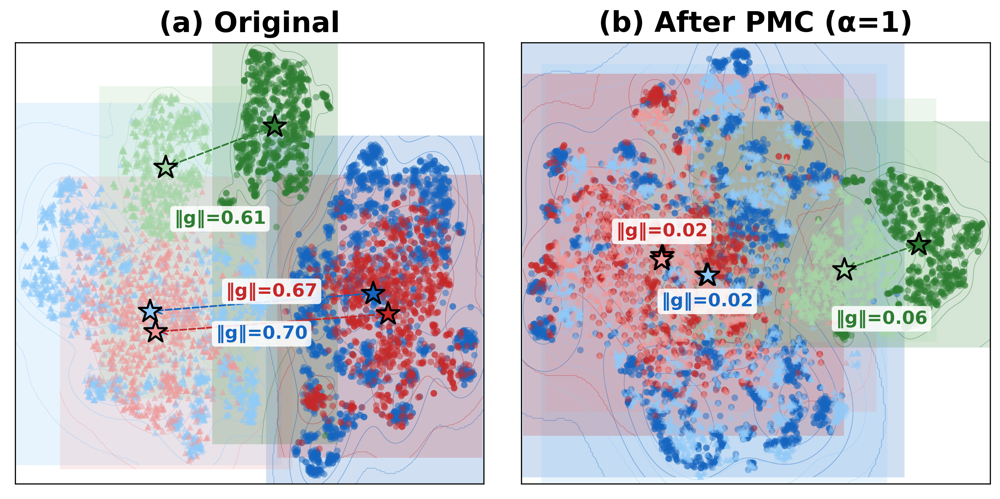
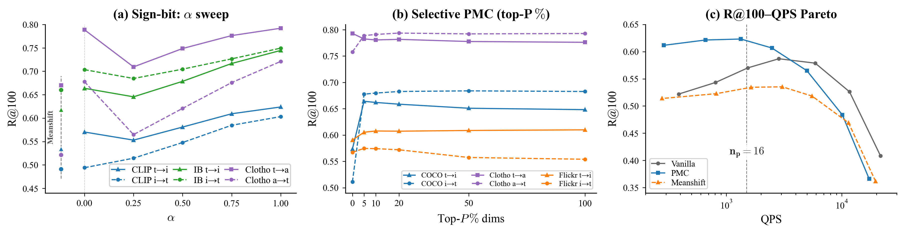

# PMC

### PMC: Build-Time Per-Modality Centroid Correction for Cross-Modal Binary-Quantized Retrieval

[](https://dl.acm.org/conference/cikm)
[](https://www.python.org/)
[](LICENSE)

---

PMC is a **zero-cost preprocessing step** that fixes the modality gap problem in binary quantized retrieval (RaBitQ). A one-line vector shift applied at index build time closes the gap between text and image centroids, recovering up to **+45% R@100** with no change in memory or throughput.

<p align="center">
  
</p>

<p align="center"><em>
  <b>Figure 1.</b> t-SNE visualization of cross-modal embeddings. <b>(a)</b> Original CLIP/ImageBind features show a clear modality gap (‖g‖ = 0.61–0.70). <b>(b)</b> After PMC (α=1), all modalities collapse to a shared centroid (‖g‖ ≈ 0.02), directly improving sign-bit alignment.
</em></p>

---

## Key Results

### Binary-quantized retrieval — IVF-RaBitQFastScan

R@100, reported as **Vanilla / MeanShift / PMC**. `q→db` = text→image/audio; `db→q` = reverse. Δ = relative R@100 gain (Vanilla→PMC). Index: IVF-RaBitQFastScan with `n_list = ceil(sqrt(n))` (the FAISS IVF sizing heuristic) and a matched query budget of `n_probe ≈ n_list/4`.

| Dataset | Enc. | ‖g‖ | Dir. | Vanilla | MeanShift | PMC | Δ |
|---------|------|-----|------|---------|-----------|------|---|
| MSCOCO val5k | CLIP-ViT-B/32 | 0.82 | q→db | 0.58 | 0.54 | **0.63** | +9% |
| MSCOCO val5k | CLIP-ViT-B/32 | 0.82 | db→q | 0.50 | 0.49 | **0.60** | +20% |
| MSCOCO val5k | CLIP-ViT-L/14 | 0.82 | q→db | 0.55 | 0.53 | **0.65** | +18% |
| MSCOCO val5k | CLIP-ViT-L/14 | 0.82 | db→q | 0.47 | 0.51 | **0.63** | +34% |
| MSCOCO val5k | ImageBind | 0.70 | q→db | 0.67 | 0.62 | **0.75** | +12% |
| MSCOCO val5k | ImageBind | 0.70 | db→q | 0.71 | 0.66 | **0.75** | +6% |
| Flickr30K | CLIP-ViT-L/14 | 0.77 | q→db | 0.41 | 0.34 | **0.48** | +17% |
| Flickr30K | CLIP-ViT-L/14 | 0.77 | db→q | 0.33 | 0.37 | **0.48** | +45% |
| Clotho | ImageBind | 0.61 | q→db | 0.72 | 0.60 | **0.73** | +1% |
| Clotho | ImageBind | 0.61 | db→q | 0.62 | 0.51 | **0.69** | +11% |
| AudioCaps | ImageBind | 0.61 | q→db | 0.75 | 0.78 | **0.78** | +4% |
| AudioCaps | ImageBind | 0.61 | db→q | 0.83 | 0.83 | **0.83** | +0% |

### LAION-400M (407M vectors, CLIP-ViT-B/32)

R@100 at `n_list=80K, n_probe=256`, single-thread CPU (i7-12700F):

| Dir. | Vanilla | MeanShift | PMC | Δ |
|------|---------|-----------|------|---|
| q→db (text→image) | 0.108 | 0.074 | **0.143** | +32% |
| db→q (image→text) | 0.069 | 0.043 | **0.073** | +6% |

With exact reranking at `K'=400`, from `results/pmc_laion400m_rerank_nlist80k_k400_seed42.csv` and its `reverse` counterpart. The forward direction keeps PMC's lead at both cutoffs; the reverse direction is the one regime where uncorrected codes win, which the paper reports and attributes to scan depth — LAION probes only 0.32% of its lists, so PMC's flatter candidate pool covers fewer true positives once exact rescoring runs deep.

| Dir. | Metric | Vanilla | MeanShift | PMC |
|------|--------|---------|-----------|------|
| q→db (text→image) | R@10 | 0.302 | 0.206 | **0.390** |
| q→db (text→image) | R@100 | 0.198 | 0.149 | **0.277** |
| db→q (image→text) | R@10 | **0.243** | 0.109 | 0.194 |
| db→q (image→text) | R@100 | **0.158** | 0.080 | 0.140 |

### Early-rank quality — R@10

R@10 at the same operating points and index protocol as the R@100 table above, from the same sources and the same round-half-up convention. PMC is best in all 14 dataset×direction configurations. Regenerate with `python scripts/reproduce_tab2_main.py` — the `q_r10_*` / `db_r10_*` columns of `results/tab2_main_reproduced.csv`.

| Dataset | Enc. | ‖g‖ | Dir. | Vanilla | MeanShift | PMC | Δ |
|---------|------|-----|------|---------|-----------|------|---|
| MSCOCO val5k | CLIP-ViT-B/32 | 0.82 | q→db | 0.40 | 0.38 | **0.46** | +15% |
| MSCOCO val5k | CLIP-ViT-B/32 | 0.82 | db→q | 0.29 | 0.30 | **0.39** | +36% |
| MSCOCO val5k | CLIP-ViT-L/14 | 0.82 | q→db | 0.36 | 0.37 | **0.48** | +33% |
| MSCOCO val5k | CLIP-ViT-L/14 | 0.82 | db→q | 0.26 | 0.35 | **0.44** | +69% |
| MSCOCO val5k | ImageBind | 0.70 | q→db | 0.55 | 0.51 | **0.63** | +14% |
| MSCOCO val5k | ImageBind | 0.70 | db→q | 0.57 | 0.54 | **0.64** | +11% |
| Flickr30K | CLIP-ViT-L/14 | 0.77 | q→db | 0.31 | 0.26 | **0.38** | +22% |
| Flickr30K | CLIP-ViT-L/14 | 0.77 | db→q | 0.22 | 0.29 | **0.38** | +79% |
| Clotho | ImageBind | 0.61 | q→db | 0.59 | 0.45 | **0.60** | +1% |
| Clotho | ImageBind | 0.61 | db→q | 0.48 | 0.35 | **0.54** | +12% |
| AudioCaps | ImageBind | 0.61 | q→db | 0.39 | 0.43 | **0.44** | +12% |
| AudioCaps | ImageBind | 0.61 | db→q | 0.44 | 0.46 | **0.48** | +9% |
| LAION-400M | CLIP-ViT-B/32 | 0.72 | q→db | 0.075 | 0.038 | **0.086** | +14% |
| LAION-400M | CLIP-ViT-B/32 | 0.72 | db→q | 0.035 | 0.028 | **0.048** | +38% |

### Ranking quality — mAP and nDCG

Exploratory run (`scripts/emit_map_ndcg.py`, seed 42), scored against exact-IP ground truth at the same operating points as the R@100 table. **PMC is best in all 12 cells on every metric.** Note that the R@100 table scores AudioCaps against caption--clip pairings, so its two rows here are not directly comparable to that table; the other ten reproduce it within ±0.005. LAION-400M is out of scope for this run.

| Dataset | Enc. | Dir. | mAP@100 (Van / MS / PMC) | nDCG@100 (Van / MS / PMC) |
|---------|------|------|--------------------------|---------------------------|
| MSCOCO val5k | CLIP-ViT-B/32 | q→db | 0.474 / 0.433 / **0.544** | 0.642 / 0.607 / **0.693** |
| MSCOCO val5k | CLIP-ViT-B/32 | db→q | 0.374 / 0.391 / **0.508** | 0.563 / 0.569 / **0.668** |
| MSCOCO val5k | CLIP-ViT-L/14 | q→db | 0.434 / 0.440 / **0.578** | 0.609 / 0.608 / **0.716** |
| MSCOCO val5k | CLIP-ViT-L/14 | db→q | 0.327 / 0.412 / **0.547** | 0.525 / 0.585 / **0.696** |
| MSCOCO val5k | ImageBind | q→db | 0.603 / 0.546 / **0.703** | 0.733 / 0.690 / **0.802** |
| MSCOCO val5k | ImageBind | db→q | 0.639 / 0.593 / **0.704** | 0.763 / 0.722 / **0.803** |
| Flickr30K | CLIP-ViT-L/14 | q→db | 0.275 / 0.223 / **0.364** | 0.475 / 0.413 / **0.555** |
| Flickr30K | CLIP-ViT-L/14 | db→q | 0.178 / 0.248 / **0.358** | 0.381 / 0.444 / **0.551** |
| Clotho | ImageBind | q→db | 0.660 / 0.512 / **0.675** | 0.777 / 0.668 / **0.786** |
| Clotho | ImageBind | db→q | 0.537 / 0.402 / **0.615** | 0.688 / 0.582 / **0.746** |
| AudioCaps | ImageBind | q→db | 0.640 / 0.498 / **0.662** | 0.762 / 0.650 / **0.771** |
| AudioCaps | ImageBind | db→q | 0.574 / 0.453 / **0.654** | 0.710 / 0.616 / **0.770** |

Mean relative gain over vanilla: mAP@100 +28.9%, R@10 +25.6%, mAP@10 +16.6%, R@100 +15.6%, nDCG@100 +14.3%, nDCG@10 +9.7% — PMC returns true neighbours *and* ranks them higher, so R@100 is the conservative reading of its benefit.

> Caveat: with a 100-item ground truth, the @10 metrics saturate (any 10 hits inside the true top-100 score 1.0), so mAP@100 / nDCG@100 are the discriminative pair here. Single seed, single operating point, no confidence intervals.

> PMC adds **zero memory** and keeps query throughput within **1%** of vanilla RaBitQ across all configurations.

---

## Method

Cross-modal embeddings (e.g., CLIP text vs. image) cluster around **different centroids** per modality. RaBitQ's sign-based encoding assumes a shared distributional center; the centroid mismatch flips roughly 16% of signs near the decision boundary, causing systematic recall loss.

PMC corrects both sides with a single offset:

```
g  = mean(query_features) − mean(db_features)          # modality gap vector

x' = normalize(x + α · g)       # database vectors at build time
q' = normalize(q − (1−α) · g)   # query vectors at search time
```

With `α = 1`, the full correction is absorbed into the index at build time (zero query-time overhead). The gap vector `g` is computed once from a small calibration set (~5K samples) and stored alongside the index.

## Analysis

<p align="center">
  
</p>

<p align="center"><em>
  <b>Figure 3.</b> <b>(a)</b> Binary-quantization α sweep — R@100 improves monotonically with α across all backbones and index types (RaBitQ, IVFPQ, OPQ); α=1 is optimal. <b>(b)</b> Selective PMC — correcting only the top-5% gap-energy dimensions already recovers peak recall on MSCOCO; low-gap Clotho needs broader correction. <b>(c)</b> R@100–QPS Pareto — PMC dominates vanilla and mean shift at every operating point.
</em></p>

---

## Installation

```bash
pip install -r requirements.txt
python -m pytest tests/ -x -q
```

**Requirements:** Python 3.9+, NumPy, faiss-cpu (or faiss-gpu), PyTorch (for encoder scripts only).

---

## Reproduction

Each script maps to one paper element. Run from the repo root.

| Script | Paper Element |
|--------|---------------|
| `scripts/reproduce_tab1_signbit_methods.py` | Table 1: Binary-quantization methods (R@100, Vanilla/PMC) |
| `scripts/reproduce_tab2_main.py` | Table 2: Main PMC results (IVF-RaBitQFastScan), No-reranking columns |
| `scripts/reproduce_tab2_rerank.py` | Table 2: Main PMC results, With-reranking columns (K'=400) |
| `scripts/reproduce_laion400m.py` | Table 2: LAION-400M large-scale row |
| `scripts/reproduce_ablation_rerank.py` | LAION-400M K'-sweep reranking ablation (repo-only) |
| `scripts/analysis/verify_signbit_analysis.py` | Table 3: sign-bit mechanism metrics (Flip%, J@100) |
| `scripts/analysis/verify_calibration.py` | Table 3: calibration cosine (cos@25); §4.4 calibration prose |
| `scripts/reproduce_mechanism_controls.py` | Tables 3-4: bit-flip/J@100, exact control, component ablation, calibration sensitivity |
| `scripts/reproduce_tab3_mech_extra.py` | Table 4: component ablation + IVF-RaBitQ controls (filename keeps legacy `tab3` prefix) |
| `scripts/reproduce_mechanism_additional_controls.py` | Table 4: Additional IVF-RaBitQ controls |
| `scripts/reproduce_gapcal_comparison.py` | Centroid-alignment strategy comparison (validates DB-side build-time correction) |
| `scripts/reproduce_tab4_multibit.py` | Table 5: Multi-bit IVFPQ/OPQ generality (filename keeps legacy `tab4` prefix) |
| `scripts/reproduce_table3_pq_sweep.py` | PMC + PQ alpha sweep (feeds Table 5; Fig. 3a) |
| `scripts/reproduce_fig3_analysis_bcd.py` | Figure 3: alpha sweep, selective PMC, QPS Pareto panels |
| `scripts/reproduce_figure_c.py` | Figure: Selective PMC analysis |
| `scripts/reproduce_qps_pareto.py` | QPS vs Recall Pareto plot |
| `scripts/reproduce_gap_energy.py` | Method: gap-energy concentration claim |
| `scripts/reproduce_clotho.py` | Clotho audio retrieval (R@1) |
| `scripts/reproduce_audiocaps.py` | AudioCaps audio retrieval (R@1) |
| `scripts/emit_map_ndcg.py` | mAP/nDCG ranking-quality sweep (exploratory; not a paper element; FAISS-bound, needs `data/features/`) → `results/map_ndcg_seed42.csv` |
| `scripts/generate_figure.py` | Combined figure for paper |

### Quick mechanism check (no GPU required)

```bash
PMC_FEATURES_DIR=data/features \
python scripts/reproduce_mechanism_controls.py \
  --settings mscoco_clip audiocaps_imagebind --skip-heavy
```

Expected outputs in `results/`:
- `mechanism_bitflip.csv` (24 rows)
- `mechanism_exact_control.csv` (8 rows)
- `mechanism_component_ablation.csv` (8 rows)
- `mechanism_calibration_sensitivity.csv` (50 rows)

---

## Data Requirements

The reproduce scripts for the paper's tables read committed CSVs in `results/` and
run straight from a clone. Everything else — the `emit_*.py` builders and the
dataset-specific scripts — needs pre-extracted features under `data/features/`,
which are not in the repo (several GB).

**Feature files are flat, not nested**, and names encode dataset, split, encoder,
modality and seed:

```
data/features/
  mscoco_karpathy_val5k_clip_image_seed42.npy
  mscoco_karpathy_val5k_clip_text_seed42.npy
  mscoco_karpathy_val5k_clip-l_image_seed42.npy
  flickr30k_full_clip-l_image_seed42.npy
  audiocaps_test_imagebind_audio_seed42.npy
  clotho_all_imagebind_text_seed42.npy
  ...
```

Point `features_dir` at that directory in `config/paths.yaml`, or override it with
`PMC_FEATURES_DIR`. A script that cannot find a file prints the exact path it
expected, which is the quickest way to check your layout.

### Getting the source datasets and extracting features

`scripts/data_prep/` holds the pipeline that produced the caches. Every script has
a `__main__` guard and runs from the repo root.

| Stage | Script | Covers |
|-------|--------|--------|
| Download | `download_audiocaps_ytdlp.py` | AudioCaps audio via yt-dlp |
| Extract (ImageBind) | `extract_imagebind_audiocaps_hf.py` | AudioCaps via the official HuggingFace protocol CSV |
| Download + extract | `download_and_extract_clotho.py` | Clotho v2 from Zenodo, then ImageBind features for all splits |
| Extract (CLIP) | `extract_clip_features.py` | MSCOCO and Flickr30K, CLIP-B/32 and CLIP-L/14 |
| Extract (CLIP) | `extract_clip_flickr30k_full.py` | Flickr30K full 31K split |
| Extract (ImageBind) | `extract_imagebind_features.py` | MSCOCO and AudioCaps |
| Extract (ImageBind) | `extract_imagebind_audiocaps.py` | AudioCaps alone |
| Download | `download_laion400m.py` | LAION-400M embedding shards |

The LAION scripts read their shard directory from `LAION400M_DIR`; without it they fall
back to a path from the original machine.

MSCOCO and Flickr30K images are not downloaded for you: fetch them from their
official distributions (Flickr30K requires accepting a usage agreement) and point
`raw_dir` at them, or pass `raw_dir` to the extraction call. AudioCaps and Clotho
are handled end to end by the scripts above.

Encoders are frozen and never fine-tuned, so the checkpoint version you extract
with determines the features.

> Re-extraction will not reproduce the paper's numbers exactly. AudioCaps in
> particular drifts as YouTube clips are removed: the paper's run covered 672 clips
> and 3,346 captions, while the current metadata yields 884 and 4,415. This is why
> the committed CSVs in `results/`, not the raw data, are the canonical source of
> truth — see `docs/PAPER_RESULT_PROVENANCE.md`.

---

## Project Structure

```
PMC/
├── src/
│   ├── pmc/            # Core PMC algorithm
│   ├── index/          # FAISS index wrappers
│   ├── metrics/        # Recall@K, QPS measurement
│   ├── datasets/       # Dataset loaders
│   ├── experiments/    # Experiment drivers
│   └── features/       # Feature loading / caching
├── scripts/            # Reproduction scripts (one per paper element)
├── paper/              # LaTeX source and compiled PDF
│   └── figures/        # Figure source (.py) and outputs (.pdf, .png)
├── results/            # Paper-critical CSV outputs (committed)
├── tests/              # Unit tests
├── docs/               # Architecture and method design notes
├── config/             # Path configuration
└── requirements.txt
```

---

## Citation

```bibtex
@inproceedings{kim2026pmc,
  title     = {{PMC}: Build-Time Per-Modality Centroid Correction
               for Cross-Modal Binary-Quantized Retrieval},
  author    = {Kim, Se Hoon and Lee, Jun Hyung and Jung, Soonyoung},
  booktitle = {Proceedings of the 35th ACM International Conference on
               Information and Knowledge Management (CIKM)},
  year      = {2026}
}
```
